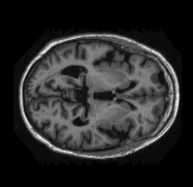
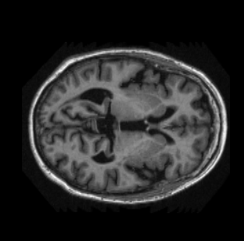
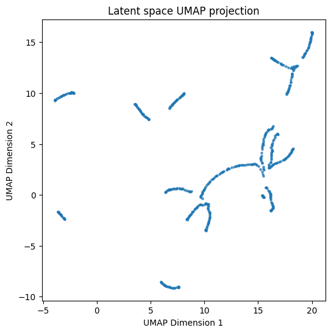

# 🧠 Variational Autoencoder for Brain MRI (OASIS Dataset)

This project implements a **Variational Autoencoder (VAE)** to learn a latent representation of **Magnetic Resonance (MR) brain images** from the **OASIS dataset**.  
The model is trained on preprocessed MRI slices and visualizes the latent manifold using **UMAP dimensionality reduction**.

---

## ✨ Features
- Custom **PyTorch VAE architecture** (Encoder, Latent space reparameterization, Decoder).
- Training on the **OASIS brain MRI dataset** (PNG slices).
- Loss function with **binary cross-entropy reconstruction loss** + **KL divergence**.
- Visualization of the learned latent manifold with **UMAP**.
- Configurable hyperparameters (hidden size, latent size, β-VAE scaling, etc.).

---

## 📂 Dataset

The dataset used is the **OASIS MRI dataset**:

example MRI slices: 
<table>
  <tr>
    <td></td>
    <td></td>
  </tr>
</table>

https://filesender.aarnet.edu.au/?s=download&token=f7f699a7-5e9c-4723-a6ae-48b54375501a 

---
## 📖 Theory
A **Variational Autoencoder (VAE)** is a type of generative model that learns to encode high-dimensional data (like images) into a **lower-dimensional latent space**, while being able to reconstruct the original data.  

Unlike a standard autoencoder, a VAE introduces **probabilistic latent variables**:
- The encoder maps input data into a distribution over the latent space (with **mean** μ and **log-variance** logσ²).  
- A **reparameterisation trick** samples latent variables from this distribution, allowing backpropagation.  
- The decoder reconstructs the input from these latent samples.  

The loss has two terms:
1. **Reconstruction loss** (Binary Cross-Entropy): ensures outputs are similar to inputs.  
2. **KL divergence**: regularises the latent distribution to be close to a standard normal distribution.  

This balance encourages the model to learn a **smooth latent manifold**, making it possible to:
- Interpolate between data points,  
- Generate new samples,  
- Visualise the structure of the dataset.

---

## 🏗️ Model Architecture

The implementation consists of **three main components**:

### 🔹 Encoder
- Input: flattened 64×64 grayscale MRI slice → 4096 features.  
- Fully connected layers project input → hidden representation.  
- Produces hidden features passed to the latent space module.  

### 🔹 Latent Space (Reparameterisation)
- Outputs two vectors: **μ (mean)** and **logσ² (log-variance)**.  
- Uses the **reparameterisation trick**:  
  \[
  z = \mu + \sigma \cdot \epsilon,\ \epsilon \sim \mathcal{N}(0, I)
  \]  
- Ensures stochasticity while remaining differentiable.  

### 🔹 Decoder
- Input: latent vector \( z \).  
- Fully connected layers reconstruct the image back to 64×64 pixels.  
- Output activation: **sigmoid**, producing pixel values in \([0, 1]\).  

---

### 📊 Summary of Layers

- **Input**: \( 64 \times 64 = 4096 \) pixels.  
- **Encoder**: Linear(4096 → hidden) → ReLU → Linear(hidden → hidden).  
- **Latent Space**: Two Linear layers → μ and logσ² (latent size = 8).  
- **Decoder**: Linear(latent → hidden) → ReLU → Linear(hidden → 4096) → Sigmoid.  
- **Output**: Reconstructed 64×64 MRI image.  

---
## 📊 Latent Space Visualization (UMAP)

One of the key outcomes of training the VAE is the ability to **map high-dimensional brain MRI data into a low-dimensional latent space**.  

The figure below shows a **UMAP (Uniform Manifold Approximation and Projection)** projection of the latent space learned by the model:

### 🔎 Interpretation
- Each point corresponds to the **latent representation** of one MRI slice.  
- Clusters and curved structures indicate that the model has learned to **organize brain images into meaningful groups** in latent space.  
- Points that are close together in this 2D plot represent MRI slices that are **similar in anatomy or intensity** in the original dataset.  
- Gaps or distinct clusters suggest regions of latent space that correspond to different anatomical variations, preprocessing differences, or noise.  

  
